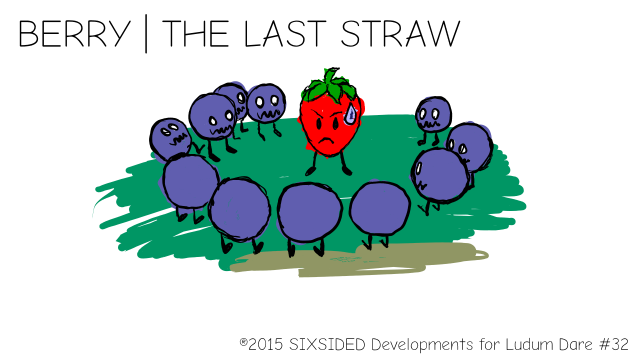

# Berry | The Last Straw

## My entry for the Ludum Dare #32 Jam

Berry is a strawberry, the last one actually :P, in the middle of a zombie grape apocalypse. He knows he's goin' down, but not without a fight!

To fight the horde of zombie grapes his only weapons are his own seeds, but he has to spin really fast to throw'em on to cause enough damage. The downside of this is that he doesn't have control on the direction of his projectiles!

But there's more! The seeds are parts of his own body so, whenever he throws one he starts to lose juice!

Luckily, he can regrow the seeds he threw and recover his own health, BUT he can't do both at the same time! Berry can only recover his health with his pack full of seeds!

Run, shoot, wait, recover, shoot again, run even more then DIE! :3

Too bad for you, Berry...

-----

## License

The code in this repo, is distributed under the MIT License.

The artwork and music, though, isn't. If you want to use part of the artwork in here to create derivative works or other uses, just contact me! It doesn't hurt and feels nice, ok? :)

The fonts I used for this project were **Dekar**, by _Font Fabric_, and **Comic Neue**, by _Craig Rozynski_.

-----

## Versions

See the releases here on top of this page.

There are three versions, as of now:

 - Windows;
 - Android;
 - Flash;

-----

## Building

To build the project, you need the latest OpenFl and Lime tools installed. Also, you need Actuate.

This project was made using OpenFl 3.0.2, but I recommend you to build it using legacy mode (with the `-Dv2` and `-Dlegacy` flags), for performance (mainly on the Windows version).

-----

## Controls

Click, hold and drags your mouse on the game screen to move Berry. Press spacebar to spin and throw seeds!

On the Android version, you do both with the touch. So it's like "sudden death" mode for mobile users. :3

-----

Post mortem coming soon! (As soon as I get enough sleep! :P

-----

## Special Thanks

My girlfriend, **Glauce Fernandes**, who gave me courage, motivation ans also inspiration to pass through this trial, and whom I thank for all the good things in my life for the last 8 years! ;*

My **whole family**, which understood me and let me do what I wanted for my own life, even though sometimes it means go against their opinions. :)

To a **LOT** of people in the LD irc channel, people the OpenFl community (forgot to put it here >_<), commenters, people on twitter and everybody who answered my newbie questions. ;)
